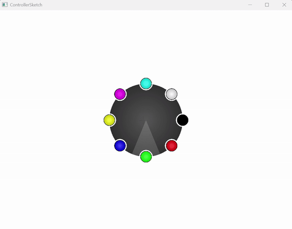

# ControllerSketch - PS5 Controller Drawing App (C++/Qt)

ControllerSketch is a real-time sketching app powered by a PS5 controller. Draw using analog stick input, control brush size and opacity with the triggers, and select colors through an intuitive radial menu.

## Features

- Analog cursor with the left stick
- Pressure sensitive brush size using R2
- Pressure sensitive brush opacity using L2
- Radial wheel color picker using L1
- Clear canvas using L3
- Save canvas to PNG using Start
- Visual flash confirmation upon saving
- Built with C++, Qt6, and SDL2

## Project Structure
```
ControllerSketch/
├── src/
├── CMakeLists.txt
├── README.md
└── .vscode/
```

## Build Instructions

### Prerequisites

- CMake (v3.10+)
- Ninja (optional, recommended)
- Qt6 (Widgets)
- SDL2
- A connected PS5 (DualSense) controller
- g++ (via MSYS2 or WSL for Windows)
- VS Code (optional, recommended)

### Build with CLI
```
cmake -S . -B build -G Ninja
cmake --build build
./build/ControllerSketch             # Or .exe on Windows
```

## Controls

| Input             | Action                         |
|------------------|--------------------------------|
| Left Stick        | Move cursor                   |
| R2 (pressure)     | Adjust brush size             |
| L2 (pressure)     | Adjust brush opacity          |
| L1 + Right Stick  | Open color wheel              |
| L3                | Clear canvas                  |
| Start             | Save PNG                      |

## Demo



## Notes

- Make sure your PS5 controller is connected before launching the app.


## License
MIT - see [LICENSE](LICENSE)

## Author

Built by Matt Carlino as a creative tool and learning project.